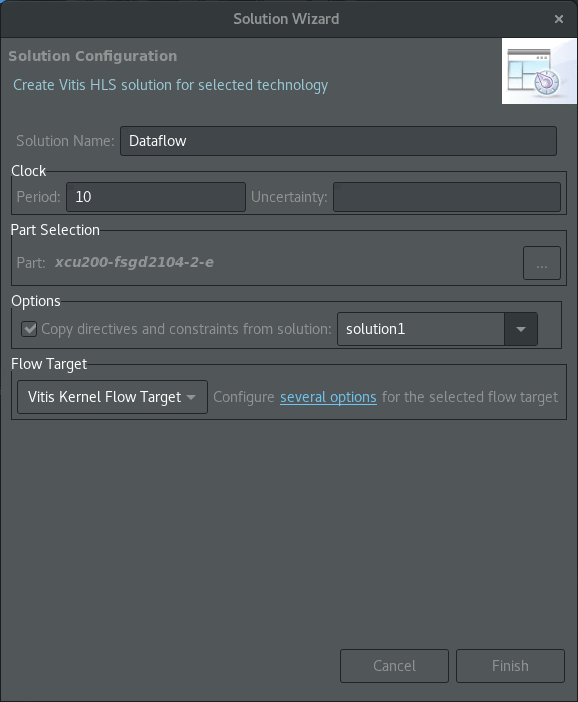
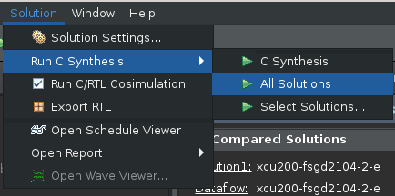
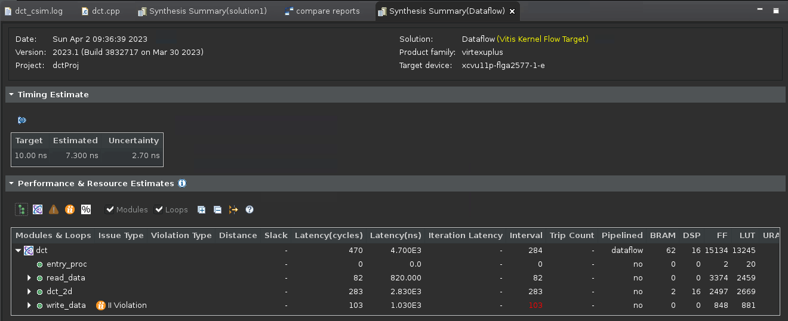
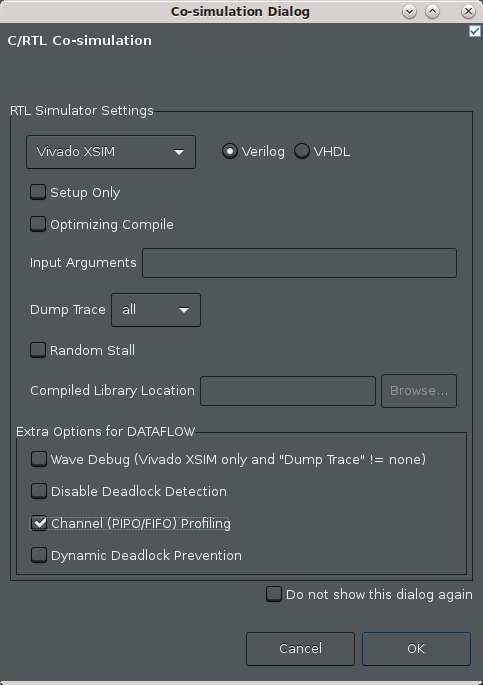
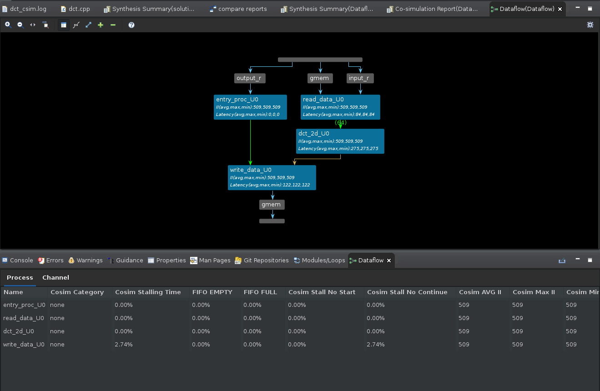

   <table class="sphinxhide" width="100%">
 <tr>
   <td align="center"><h1>Vitis™ Application Acceleration Tutorials</h1>

   </td>
 </tr>
 <tr>
 <td>
 </td>
 </tr>
</table>

### 4. Reviewing the DATAFLOW Optimization

In the earlier steps, you found different ways to optimize the DCT algortithm so that you could achieve an II=1 with the pipelined loops. In this step, you use the DATAFLOW directive to enable task-level parallelism for functions or loops. For more information, refer to [set_directive_dataflow](https://docs.xilinx.com/r/en-US/ug1399-vitis-hls/set_directive_dataflow) in the Vitis HLS flow of the Vitis Unified Software Platform documentation (UG1416).

The DATAFLOW optimization tries to create task-level parallelism between the various functions in the code,  on top of the loop-level parallelism where possible.

#### Create a New Solution

As described in [Creating Additional Solutions](https://docs.xilinx.com/r/en-US/ug1399-vitis-hls/Creating-Additional-Solutions) in the Vitis HLS flow of the Vitis Unified Software Platform documentation (UG1416), you can create multiple solutions to let you pursue or explore different approaches to optimizing your design. Here you will create a new solution to explore the use of the DATAFLOW optimization.

1. In the Explorer view, select the top-level project (`dct_prj`).
2. Right-click and select **New Solution**.

   The Solution Wizard dialog box opens.
3. Make the following selections:
   1. In the Solution Name field, enter `DATAFLOW`.
   2. In the Options section, make sure the Copy directives and constraints from solution check box is selected, and `solution1` is selected.
   3. Leave all other settings as default, as shown in the following figure.

        

   4. To create the new solution, click **Finish**.

   >**TIP:** When you create a new solution, it is set as the active solution that all of the simulation, synthesis, and other commands are directed towards. You can change the active solution by right-clicking a solution in the Explorer view and selecting **Set Active Solution**.

#### Add the DATAFLOW Optimization

1. Select the `dct.cpp` tab to make the Code Editor active.

2. In the Directive view, select the top-level `dct` function, right-click and select **Insert Directive**.

   This opens the Vitis HLS Directive Editor.
   

3. Make the following selections:
   1. In the the Directive Field, select **DATAFLOW**.
   2. In the Destination field, select **Directive File**.
   3. Click **OK** to close the form, and apply the directive.
4. From the main menu select **Solution > Run C Synthesis > All Solutions** to rerun synthesis. This runs synthesis for all solutions, letting you compare the results.

   

   After synthesis completes, the Synthesis Summary report is displayed for the active solution; in this case, the DATAFLOW solution. A Vitis HLS Report Comparison is also displayed for the synthesis results of all solutions that were synthesized as shown in the following figure.  

    

   You can see from the comparison results, the interval for the DATAFLOW solution is about 65% of first solution results. This is the primary advantage of the task-level parallelism provided by the DATAFLOW optimization. The other thing you can see is the increased utilization estimates for FF and LUTs in the design. These are just estimates, and you will need to run Vivado synthesis and/or the implementation flow to get more accurate details on the resources used.

   The following figure shows the Synthesis Summary report for the DATAFLOW solution.

    

#### View the Dataflow Graph

Vitis HLS also provides a Dataflow Graph viewer as one of the features in the Analysis perspective. The DATAFLOW optimization is a dynamic optimization that can only really be understood after C/RTL co-simulation which provides needed performance data. After synthesis, you must run co-simulation. For more information, refer to [C/RTL Co-Simulation in Vitis HLS](https://docs.xilinx.com/r/en-US/ug1399-vitis-hls/C/RTL-Co-Simulation-in-Vitis-HLS) in the Vitis HLS Flow of the Vitis Unified Software Platform Documentation (UG1416).

1. From the menu select **Solution > Run C/RTL Co-Simulation**.
   The Co-simulation dialog box displays.
2. Make the following selections:
   1. Enable the **Channel (PIPO/FIFO) Profiling** checkbox.
   2. Click **OK**.

     

   After co-simulation completes, the tool opens the Co-simulation Report, which essentially says whether the tool passed your simulation testbench or not. In the case of Dataflow analysis, your testbench needs to call the synthesized function more than once to get the performance data from multiple iterations, and to make sure the design is flushing the FIFOs. When it comes to performance, one function call gives you latency, two or more calls to the function can give you the II.

3. After the simulation completes, select **Solution** > **Open Dataflow Viewer** to open the viewer as shown in the following figure.

   >**TIP:** You can tell if the design has a Dataflow graph by the presence of the  icon on the project in the Explorer view or the Synthesis Summary.

   The DataFlow Viewer displays the function and the flow through the function. After running C/RTL co-simulation, the elements of the graph are filled out with performance data, and the Process and Channel tables beneath the graph are also filled out. Without the performance data provided by co-simulation, the graph and tables will have NA values to reflect the missing values. For more information, refer to [Dataflow Viewer](https://docs.xilinx.com/r/en-US/ug1399-vitis-hls/Dataflow-Viewer) in the Vitis HLS Flow of the Vitis Unified Software Platform Documentation (UG1416).

   

   The Dataflow Viewer enables the following throughput analysis options:

      * The graph shows the overall topology of the DATAFLOW region and shows what type of channels (FIFO/PIPO) were inferred for communication between the tasks in the DATAFLOW region. Analyzing each channel and process can be useful to resolve issues such as deadlock or poor throughput due to bad FIFO sizing. 
      * The co-simulation data helps with the FIFO sizing problem by tracking the maximum size of the FIFO during the course of the simulation and thereby giving the user a good reference point on how to size the FIFOs. In addition, when running cosimulation, automatic deadlock detection can highlight the processes and channels involved in the deadlock allowing the user to quickly narrow the focus and fix the issue. 
      * In addition to FIFO sizing, the data reported after cosimulation also provides, on a per process and channel basis, the time spent stalling either waiting for input or blocked from writing output. The graph helps the user understand such issues and manage how the channels are sized to accommodate slow producers versus fast consumers and/or vice-versa. In addition, the graph is useful in understanding how reading from the input in the middle of a DATAFLOW region can impact performance. This is a fairly common scenario where performance can be impacted.  

#### Convert the Directives into Pragmas

Now that you have your optimized design, you can transfer the directives from a Tcl script, which the Vitis HLS tool runs, to pragmas in the source code which can be shared to other users or design teams, and used within the Vitis unified software platform. Select the directives in the Directive view, and change them to pragmas using the following process.

1. Select the `dct.cpp` tab to make the Code Editor active, or open the source code if needed.

2. Scroll through the Directives view, right-click any directives you see, and select the **Modify Directive**. This displays the Vitis HLS Directive Editor.

3. In the Directive Editor, change the Destination to **Source File**, and click **OK**. This changes the directive to a pragma written to the source code files, which you can view displayed in the `dct.cpp` source file. 

   When you change the `ARRAY_PARTITION` directive for the `col_inbuf` variable, the tool will return a **Warning** indicating that it cannot find the `col_inbuf` variable, and will insert the pragma at the first line of the function. Select **OK** to insert the pragma as indicated. 

   You must manually correct the placement of the pragma by cutting and pasting the `#pragma HLS ARRAY_PARTITION...` line into the `dct.cpp` file after the definition of the `col_inbuf` variable on line 42. The pragma must be defined after the variable in order to be associated correctly by the compiler. If this is not done, Vitis HLS will return an error when trying to compile the code.

   With the directives converted to pragmas, the `dct.cpp` code is now portable and carries the optimizations you have completed within the code. 

4. To save the `dct.cpp` file with the pragmas into the `./vitis_hls_analysis/reference-files` folder, select **File** > **Save As**. You can use the file in the next lab. 

#### Export the Vitis Kernel

Finally, you can export the results of the high-level synthesis as a synthesized kernel (`.xo`) file.

1. From the main menu select **Solution > Export RTL**. The Export RTL dialog box opens.
2. For Format Selection, select **Vitis Kernel (.xo)**.
3. In the Output location field specify the `./vitis_hls_analysis/reference-files` folder to write the `dct.xo` file.
4. To export the kernel, select **OK**.

## Summary

In this tutorial:

1. You worked to optimize C/C++ code in the Vitis HLS tool, to synthesize it into RTL code for use in the Vitis application acceleration development flow. 
2. With the code optimized, you exported the compiled kernel object (`.xo`) file for use in a Vitis application project. 

These are the elements of building and accelerating applications and functions using the Vitis and Vitis HLS tools. You can mix the Vitis HLS kernels with RTL kernel objects (`.xo`) and uncompiled C/C++ kernel code (`.c`/`.cpp`) in the Vitis application project to create more complex accelerated applications. 

You have the optimized but uncompiled C++ code (`dct.cpp`) that you saved in an earlier step of this tutorial. You can remove the HLS kernel object and add this optimized C++ code in the Vitis application project if you prefer. In this case, the Vitis IDE will call Vitis HLS as part of the build process when compiling the C++ kernel code.  

 

<b><a href="/README.md">Return to Main Page</a> — <a href="./README.md">Return to Start of Tutorial</a></b>

Copyright © 2020–2023 Advanced Micro Devices, Inc

<a href="https://www.amd.com/en/corporate/copyright">Terms and Conditions</a>

