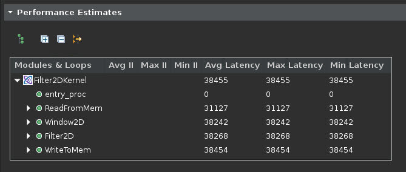
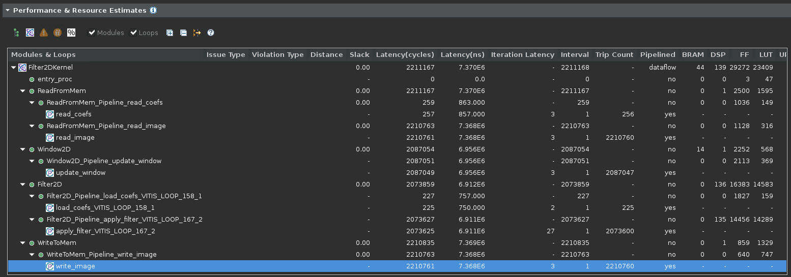

<table class="sphinxhide" width="100%">
 <tr width="100%">
    <td align="center"><h1>Vitis™ Hardware Acceleration Tutorials</h1>
    <a href="https://www.xilinx.com/products/design-tools/vitis.html">See Vitis™ Development Environment on xilinx.com</a>
    </td>
 </tr>
</table>

# Design and Analysis of Hardware Kernel Module for 2-D Video Convolution Filter

This lab is designed to demonstrate the design of a convolution filter module, do performance analysis, and analyze the hardware resource utilization. A bottom-up approach is followed by first developing the hardware kernel and analyzing its performance before integrating it with the host application. You will use Vitis HLS to build and estimate the performance of the kernel.

## 2-D Convolution Filter Implementation

This section discusses the design of a convolution filter in detail. It goes through its top-level structure, optimizations performed, and implementation details.

### Top Level Structure of Kernel

The top-level of the convolution filter is modeled using a dataflow process. The dataflow consists of four different functions as follows. For full implementation details, refer to the source file  `src/filter2d_hw.cpp` in the convolutional tutorial directory.

```cpp
void Filter2DKernel(
        const char           coeffs[256],
        float                factor,
        short                bias,
        unsigned short       width,
        unsigned short       height,
        unsigned short       stride,
        const unsigned char  src[MAX_IMAGE_WIDTH*MAX_IMAGE_HEIGHT],
        unsigned char        dst[MAX_IMAGE_WIDTH*MAX_IMAGE_HEIGHT])
  {
    #pragma HLS DATAFLOW

  // Stream of pixels from kernel input to filter, and from filter to output
    hls::stream<char,2>    coefs_stream;
    hls::stream<U8,2>      pixel_stream;
    hls::stream<window,3>  window_stream; // Set FIFO depth to 0 to minimize resources
    hls::stream<U8,64>     output_stream;

  // Read image data from global memory over AXI4 MM, and stream pixels out
    ReadFromMem(width, height, stride, coeffs, coefs_stream, src, pixel_stream);

    // Read incoming pixels and form valid HxV windows
    Window2D(width, height, pixel_stream, window_stream);

  // Process incoming stream of pixels, and stream pixels out
  Filter2D(width, height, factor, bias, coefs_stream, window_stream, output_stream);

  // Write an incoming stream of pixels and write them to global memory over AXI4 MM
  WriteToMem(width, height, stride, output_stream, dst);
  }
```

The dataflow chain consists of four different functions as follows:

- **ReadFromMem**: Reads pixel data or video input from main memory
- **Window2D**: Local cache with wide (15x15 pixels) access on the output side
- **Filter2D**: Core kennel filtering algorithm
- **WriteToMem**: Writes output data to the main memory

Two functions at the input and output read and write data from the device's global memory. The `ReadFromMem` function reads data and streams it for filtering. The `WriteToMem` function at the end of the chain writes processed pixel data to the device memory. The input data (pixels) read from the main memory is passed to the `Window2D` function, which creates a local cache and, on every cycle, provides a 15x15 pixel sample to the filter function/block. The `Filter2D` function can consume the 15x15 pixel sample in a single cycle to perform 225(15x15) MACs per cycle.

Open the `src/filter2d_hw.cpp` source file from the convolutioanl tutorial directory, and examine the implementation details of these individual functions. In the next section, you will elaborate on the implementation details of Window2D and Filter2D functions. The following figure shows how data flows between different functions (dataflow modules).

   

### Data Mover

One of the key advantages of custom design hardware accelerators, for which FPGAs are well suited, is the choice and architecture of custom data movers. These customized data movers facilitate efficient access to global device memory and optimize bandwidth utilization by reusing data. Specialized data movers at the interface with the main memory can be built at the input and output of the data processing engine or processing elements. The convolution filter is an excellent example of this. Looking from a pure software implementation point of view, it seems that to produce a single sample at the output side requires 450 memory accesses at the input side and one write access to the output.

```bash
Memory Accesses to Read filter Co-efficients = 15x15 = 225
Memory Accesses to Read Neighbouring Pixels  = 15x15 = 225
Memory Accesses to Write to Output           = 1
Total Memory Accesses                       = 451 
```  

For a pure software implementation, even though many of these accesses can become fast because of caching, a large number of memory accesses will be a performance bottleneck. But designing on FPGA allows efficient data movement and access schemes to be easily built. One of the key and major advantages is the availability of substantial on-chip memory bandwidth (distributed and block memory) and the choice of a custom configuration of this bandwidth. This custom configuration choice essentially allows you to create an on-demand cache architecture tailored explicitly for the given algorithm. The next section elaborates on the design of the `Window2D` block.

#### Window2D: Line and Window Buffers

The `Window2D` block is essentially built from two basic blocks: the first is called a "line buffer", and the second is called a "Window".

- The line buffer is used to buffer multiple lines of a full image, and specifically, here it is designed to buffer **_FILTER_V_SIZE - 1_** image lines, where FILTER_V_SIZE is the height of the convolution filter. The total number of pixels held by the line buffer is **(FILTER_V_SIZE-1) *  MAX_IMAGE_WIDTH**.  
- The "Window" block holds **FILTER_V_SIZE * FILTER_H_SIZE** pixels. The 2-D convolution filtering operation consists of centering the filtering mask (filter coefficients) on the index of output pixel and calculating the SOP as described in the previous lab. The following figure shows how these centering and SOP operations are carried.


The figure above shows SOP carried out for a full image being processed. If you look carefully when output pixels are produced line by line, it is not required to have all the image pixels in memory. Only the lines where the filtering mask overlaps are required which is essentially FILTER_V_SIZE lines, which can even be reduced to FILTER_V_SIZE-1. Essentially, that is the amount of data that needs to be on-chip or housed by a data mover at any given time.


The figure above illustrates the operation and requirements for a line and Window buffer. The image size is assumed 8x8, and the filter size is 3x3. For this example, you are generating the filtered output of pixel number 10. In this case, you need a 3x3 block of input pixels centered around pixel 10, as shown in step `A`.

Step `B` in the figure highlights what is required for producing pixel number 11. Another 3x3 block, but it has a significant overlap with the previous input block. Essentially a column moves out from the left, and a column moves in from the right. One important thing to notice in steps A, B, and C, is that from the input side; it only needs one new pixel to produce one output pixel (ignoring the initial latency of filling the line buffer with multiple pixels, which is one-time only).

The line buffer holds FILTER_V_SIZE-1 lines. In general, it requires FILTER_V_SIZE lines, but a line is reduced by using the line buffer in a circular fashion and by exploiting the fact that pixels at the start of the first line buffer can be used to write new incoming pixels since they are no longer needed. The window buffer is implemented as FILTER_V_SIZE * FILTER_H_SIZE storage fully partitioned, giving parallel access to all elements inside the window. The data moves as a column vector of size FILTER_V_SIZE from line buffer to window buffer, and then this whole widow is passed through a stream to the `Filter2D` function for processing.

The overall scheme (data mover) is built to maximize the data reuse providing maximum parallel data to the processing element. For a deeper understanding of the modeling style and minute details of the data mover, examine the `Window2D` function details in the source code. The function can be found in the `src/filter2d_hw.cpp` source file in the convolutioanl tutorial directory.

## Building and Simulating the Kernel using Vitis HLS

In this section, you will build and simulate the 2D convolution filter using Vitis HLS. You will also look at the performance estimates and measured results after co-simulation for comparison with the target performance settings.

### Building the Kernel Module

Now you will build the kernel module as a standalone kernel with AXI interfaces to memory, which are also used for simulation. To do this, use the following steps:

```bash
  cd  $CONV_TUTORIAL_DIR/hls_build
  vitis_hls -f build.tcl 
```

>**TIP:** This step can take some time to complete.

An output similar to the following will be printed:

```bash
    ----------------------------------------------------------------------------
    HLS Testbench for Xilinx 2D Filter Example
    Image info
    - Width     :       1000
    - Height    :         30
    - Stride    :       1024
    - Bytes     :      30720
    Running FPGA accelerator
    Comparing results
    Test PASSED: Output matches reference
    ----------------------------------------------------------------------------
    INFO: [COSIM 212-1000] *** C/RTL co-simulation finished: PASS ***
```

This shows that an image with Width=1000 and height=30 is simulated. There are default parameters for image dimensions, and these are kept as small values to make co-simulation run more quickly. The synthesis is done for a maximum image size of 1920x1080.

When the build and simulation are finished, launch the Vitis HLS GUI to analyze the performance estimate reports and implementation QoR as follows:

```bash
vitis_hls -p conv_filter_prj
```

After the GUI opens, the first thing to notice is the Synthesis Summary report, which shows the Performance and Resource Estimates as the following:


It shows the use of 139 DSP essentially for the SOP operations by the top-level module, and the use of 14 block RAMs by the `Window2D` data mover block.

One important thing to notice is the static performance estimate for the kernel, 7.3 ms, which is very close to the estimated target latency of 6.9 ms for the kernel as calculated in the previous lab.

You can also get an accurate measurement of latency for kernel from the Co-simulation report.  You can go to the **Solution > Open Report > Cosimulation** menu in Vitis HLS to open the Co-simulation report which will show something as follows:



Since you are simulating a 1000x30 image, the expected latency should be 30,000 + fixed latency of some blocks (assuming one clock cycle per output pixel). The number shown in the report is 38,520. Here 8,520 is the fixed latency, and when the actual image size is 1920x1080, the fixed latency will get amortized across more image lines. The fact that a large image will amortize the latency can be verified by simulating with a larger image.

Another thing that verifies that the kernel can achieve one output sample per cycle throughput is the loop initiation intervals (II). The synthesis report expanded view shows that all loops have II=1, as follows:



When you have verified that the throughput requirements are met, and the resource consumption is acceptable, you can move forward and start integrating the full application, which consists of creating and compiling the host application to drive the kernel, and building the kernel using one of the AMD platforms for Alveo Data Center accelerator cards. For this lab, the Alveo U200 card is used.

In this lab, you learned about:

- Optimized implementation of the convolution filter
- Building and kernel performance analysis using Vitis HLS

---------------------------------------

<p align="center"><b>
Next Lab Module: <a href="./lab3_build_app_kernel.md">Building the 2-D convolutional Kernel and Host Application</a>


<p class="sphinxhide" align="center"><sub>Copyright © 2020–2023 Advanced Micro Devices, Inc</sub></p>

<p class="sphinxhide" align="center"><sup><a href="https://www.amd.com/en/corporate/copyright">Terms and Conditions</a></sup></p>
